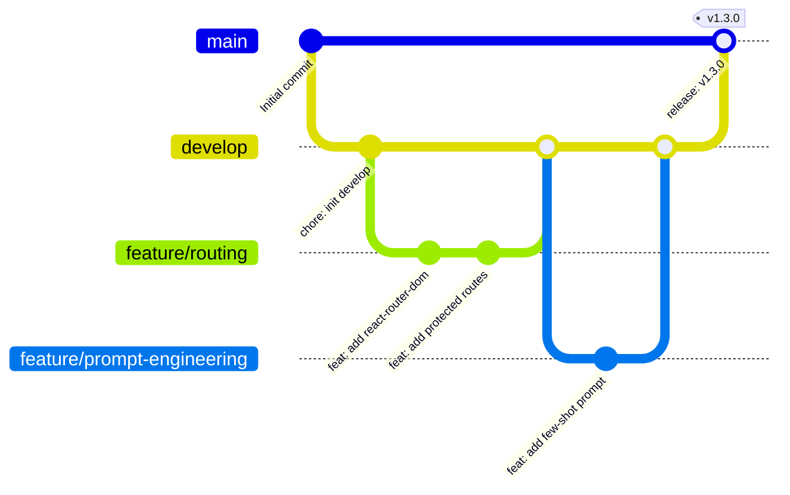

# ✦ Git Workflow & Engineering Practices Guide — Qurate

**Curriculum Concept:** Git Workflow (Engineering Practices • 0.3 pts)  
**Standard:** Conventional Commits v1.0.0 & Git Feature Branching

---

## 1. Branching Strategy

Qurate follows a structured feature-branch workflow to maintain stability on the production branch while facilitating collaborative development:



### Branch Naming Conventions:
- `main` — Production-ready code. Protected against direct pushes.
- `develop` — Active integration branch for upcoming releases.
- `feature/<short-description>` — New feature development (e.g., `feature/client-routing`, `feature/ai-scoring`).
- `bugfix/<short-description>` — Bug fixes (e.g., `bugfix/auth-token-refresh`).
- `docs/<short-description>` — Documentation updates (e.g., `docs/git-workflow`).

---

## 2. Commit Message Conventions (Conventional Commits)

Every commit must follow the [Conventional Commits](https://www.conventionalcommits.org/) specification:

```
<type>(<scope>): <short description in present tense>

[optional body explaining motivation and details]

[optional footer with issue reference, e.g. Closes #42]
```

### Supported Types:
| Type | Purpose | Example |
|:---|:---|:---|
| `feat` | Introduces a new feature | `feat: implement client-side routing with react-router-dom` |
| `fix` | Patches a bug | `fix: resolve race condition in useEffect data fetch` |
| `docs` | Documentation changes | `docs: add problem modeling domain architecture guide` |
| `refactor` | Code restructuring without feature change | `refactor: extract compound Card and Modal components` |
| `test` | Adding or updating tests | `test: add event loop microtask vs macrotask assertions` |
| `chore` | Build tasks, configs, dependencies | `chore: update dependencies in client package.json` |

---

## 3. Pull Request & Collaborative Review Lifecycle

1. **Branch Out:** Always branch out from `develop`:
   ```bash
   git checkout develop
   git pull origin develop
   git checkout -b feature/my-feature
   ```
2. **Atomic Commits:** Make small, logical commits adhering strictly to Conventional Commits.
3. **Local Rebase & Conflict Resolution:** Before opening a PR, ensure your feature branch is up to date with `develop`:
   ```bash
   git fetch origin
   git rebase origin/develop
   # If conflicts occur: resolve conflicts, git add <resolved-files>, git rebase --continue
   ```
4. **Open Pull Request:** Target `develop` using `.github/pull_request_template.md`.
5. **Branch Protection Rules:**
   - Require at least 1 approving peer review before merging.
   - Require status checks to pass (`npm run build` and backend test suites).
   - Enforce linear history using **Squash and Merge** to prevent messy merge bubbles.
6. **Hotfix Workflow:**
   - Urgent production bugs branch directly from `main` (`hotfix/fix-auth-crash`).
   - Merged into `main` with a release tag (e.g., `v1.2.1`), and immediately back-merged into `develop` to maintain synchronization.

