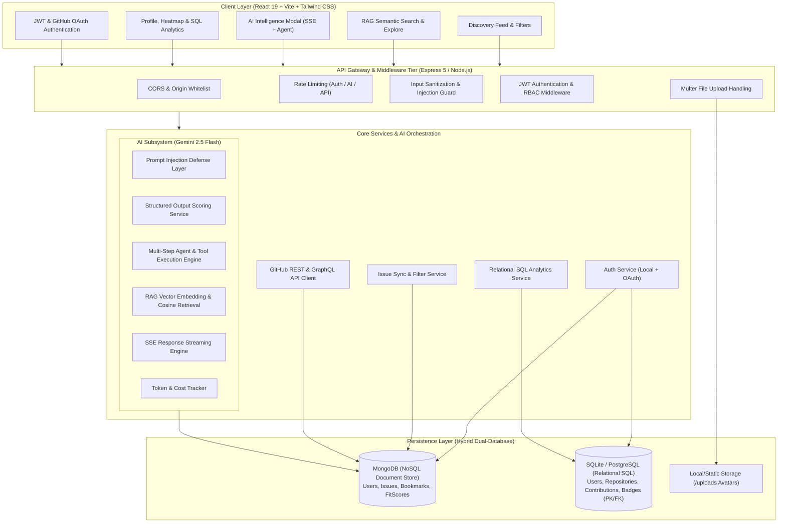
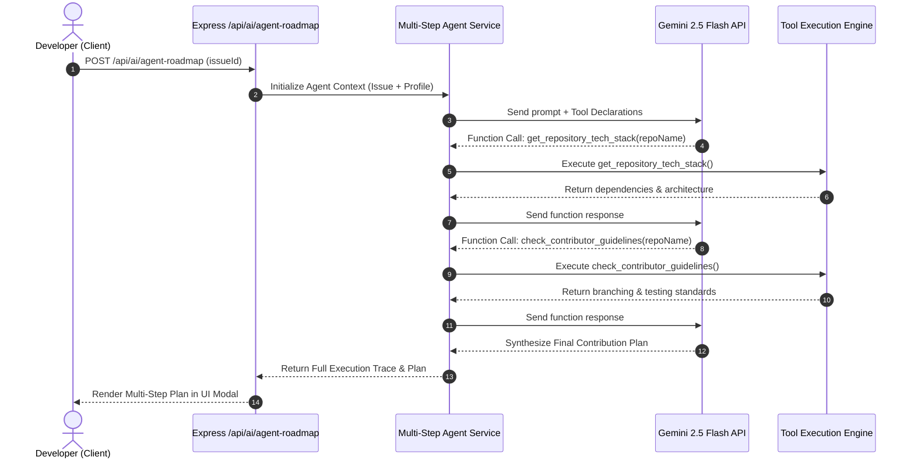

# High-Level Design (HLD) — Qurate

**System:** AI-Powered Open Source Discovery Engine  
**Version:** 1.2.0  
**Author:** Qurate Core Engineering Team  

---

## 1. System Architecture Overview

Qurate is engineered as a modern, decoupled client-server web platform with an intelligent AI subsystem and a hybrid dual-database persistence tier.

---

## 2. Technology Stack & Architectural Roles

| Tier | Technology | Purpose |
| :--- | :--- | :--- |
| **Frontend UI** | React 19, Vite, Tailwind CSS | High-performance SPA with client-side routing (`react-router-dom`), state management (`useState`, `Zustand`), and React Query. |
| **Backend Runtime** | Node.js (ES Modules), Express 5 | RESTful API server, async middleware pipeline, SSE streaming, and background scheduling. |
| **NoSQL Database** | MongoDB & Mongoose | Flexible document storage for rich GitHub issue payloads, unstructured labels, and embedded fit score histories. |
| **Relational SQL Database** | SQLite / PostgreSQL | Normalized relational storage with Primary Keys (`PK`), Foreign Keys (`FK`), and multi-table `SQL JOIN` analytics queries. |
| **AI LLM Engine** | Google Gemini 2.5 Flash (`@google/generative-ai`) | Structured fit scoring, autonomous multi-step tool-calling agent, text embeddings, and real-time streaming. |
| **Third-Party APIs** | GitHub REST API v3, GitHub GraphQL API | Live repository search, issue indexing, and contributor contribution calendars. |

---

## 3. Core Subsystems Design

### 3.1 Hybrid Dual-Database Architecture
1. **Document Storage (MongoDB):**
   - Stores flexible, highly dynamic data from external GitHub APIs (arbitrary label tags, variable stack arrays, author metadata).
   - Embedding subdocuments for fit scores (`fitScoreSchema`).
2. **Relational Storage (SQLite/PostgreSQL):**
   - Strictly enforces relational integrity with Primary Keys (`id INTEGER PRIMARY KEY`) and Foreign Keys (`FOREIGN KEY REFERENCES ... ON DELETE CASCADE`).
   - Executes performant multi-table `LEFT JOIN` and `INNER JOIN` queries for community contributor leaderboards, badges, and repository aggregations.

### 3.2 AI Subsystem Architecture
- **Prompt Injection Defense:** Untrusted issue descriptions and search queries pass through safety regex heuristics and are quarantined in XML-delimited tags before reaching the LLM.
- **Structured Outputs:** Utilizes Gemini SDK `responseSchema` with strict schema validation to guarantee deterministic JSON outputs.
- **RAG Semantic Retrieval:** Converts developer stack/experience queries into vector representations and computes cosine similarity against candidate issue embeddings.
- **Multi-Step Tool-Calling Agent:** The model autonomously determines which diagnostic tools (`get_repository_tech_stack`, `check_contributor_guidelines`, `calculate_pr_readiness_score`) to call, receives execution outputs, and synthesizes an actionable contribution plan.
- **SSE Streaming:** Employs HTTP Server-Sent Events to stream markdown tokens incrementally to the user with minimal latency.
- **Token & Cost Monitoring:** Parses `usageMetadata` (`promptTokenCount`, `candidatesTokenCount`) from LLM responses to provide cost auditing in USD.

---

## 4. Key Sequence Workflows

### 4.1 Autonomous Multi-Step Agent Execution Workflow

---

## 5. Security & Reliability Design

- **Defense in Depth:** Rate limiting on API boundaries, input sanitization against NoSQL injection & XSS, strict CORS origins.
- **Role-Based Access Control (RBAC):** Middleware hierarchy ensuring only users with the `admin` role can access administrative endpoints.
- **High Availability & Fallback:** If Gemini API rate limits (`429`) or service disruptions (`503`) occur, deterministic algorithmic fallback scoring kicks in to ensure uninterrupted user experience.
