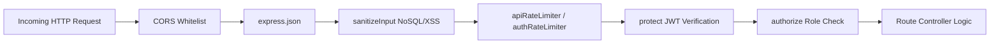

# Low-Level Design (LLD) — Qurate

**System:** AI-Powered Open Source Discovery Engine  
**Version:** 1.2.0  
**Target Module:** Server Controllers, Middleware, Data Models & AI Services  

---

## 1. Database Schema & Data Models

### 1.1 MongoDB Document Schemas (NoSQL)

#### User Schema (`models/user.js`)
```javascript
{
  username:        { type: String, required: true, trim: true },
  email:           { type: String, required: true, unique: true, trim: true },
  password:        { type: String, required: true },
  role:            { type: String, enum: ["user", "admin"], default: "user" },
  avatar:          { type: String, default: "" },
  stack:           [{ type: String, lowercase: true, trim: true }],
  experienceLevel: { type: String, enum: ["beginner", "intermediate", "advanced"], default: "beginner" },
  githubUsername:  { type: String, trim: true },
  bookmarks:       [{ type: mongoose.Schema.Types.ObjectId, ref: "Issue" }],
  contributions: [{
    issueId:        { type: String },
    repoName:       { type: String },
    issueTitle:     { type: String },
    pullRequestUrl: { type: String },
    status:         { type: String, enum: ["planned", "submitted", "merged"] }
  }],
  timestamps: true
}
```

#### Issue Schema (`models/issue.js` & `models/fitScoreSchema.js`)
```javascript
{
  github_id:   { type: Number, required: true, unique: true },
  title:       { type: String, required: true },
  body:        { type: String },
  html_url:    { type: String, required: true },
  complexity:  { type: String, enum: ["beginner", "intermediate", "advanced"], default: "beginner" },
  stacks:      [{ type: String, lowercase: true }],
  labels:      [{ type: String }],
  repo: {
    name:      { type: String },
    owner:     { type: String },
    language:  { type: String }
  },
  fitScores: [{
    userId:    { type: mongoose.Schema.Types.ObjectId, ref: "User" },
    score:     { type: Number, min: 1, max: 10 },
    reason:    { type: String },
    scoredAt:  { type: Date, default: Date.now }
  }],
  synced_at:   { type: Date, default: Date.now }
}
```

---

### 1.2 Relational SQL Database Schema (PK / FK Constraints)

```sql
-- 1. Relational Users Table
CREATE TABLE sql_users (
    id INTEGER PRIMARY KEY AUTOINCREMENT,
    mongo_user_id TEXT UNIQUE,
    username TEXT NOT NULL,
    email TEXT NOT NULL UNIQUE,
    experience_level TEXT DEFAULT 'beginner',
    created_at DATETIME DEFAULT CURRENT_TIMESTAMP
);

-- 2. Relational Repositories Table
CREATE TABLE sql_repositories (
    id INTEGER PRIMARY KEY AUTOINCREMENT,
    repo_name TEXT NOT NULL UNIQUE,
    primary_language TEXT NOT NULL,
    stars_count INTEGER DEFAULT 0,
    open_issues_count INTEGER DEFAULT 0,
    created_at DATETIME DEFAULT CURRENT_TIMESTAMP
);

-- 3. Relational Contributions Table (Foreign Keys to sql_users and sql_repositories)
CREATE TABLE sql_contributions (
    id INTEGER PRIMARY KEY AUTOINCREMENT,
    user_id INTEGER NOT NULL,
    repository_id INTEGER NOT NULL,
    issue_title TEXT NOT NULL,
    pr_status TEXT CHECK(pr_status IN ('planned', 'submitted', 'merged')) NOT NULL DEFAULT 'planned',
    created_at DATETIME DEFAULT CURRENT_TIMESTAMP,
    FOREIGN KEY (user_id) REFERENCES sql_users (id) ON DELETE CASCADE,
    FOREIGN KEY (repository_id) REFERENCES sql_repositories (id) ON DELETE CASCADE
);

-- 4. Relational Badges Table (Foreign Key to sql_users)
CREATE TABLE sql_user_badges (
    id INTEGER PRIMARY KEY AUTOINCREMENT,
    user_id INTEGER NOT NULL,
    badge_name TEXT NOT NULL,
    badge_tier TEXT DEFAULT 'Bronze',
    awarded_at DATETIME DEFAULT CURRENT_TIMESTAMP,
    FOREIGN KEY (user_id) REFERENCES sql_users (id) ON DELETE CASCADE
);
```

---

## 2. API Specifications & Endpoints

### 2.1 Authentication & Profile Endpoints (`/api/auth`, `/api/users`)
- `POST /api/auth/register` — Registers a new user. Returns JWT and user profile.
- `POST /api/auth/login` — Verifies bcrypt password hash and issues JWT.
- `POST /api/auth/github` — GitHub OAuth authorization code / profile exchange.
- `POST /api/auth/avatar` — Uploads profile image via `multer` to `/uploads`.
- `PUT /api/users/profile` — Updates stack, display name, experience level.

### 2.2 AI Subsystem Endpoints (`/api/ai`)
- `POST /api/ai/stream-analysis` — Streams chunked markdown analysis via Server-Sent Events (SSE).
- `POST /api/ai/agent-roadmap` — Executes multi-step autonomous tool-calling agent.
- `POST /api/ai/rag-search` — Performs semantic cosine similarity retrieval over issues pool.
- `POST /api/ai/prompt-safety-check` — Validates prompt against jailbreaks/injections.

### 2.3 SQL Relational Analytics Endpoints (`/api/analytics`)
- `GET /api/analytics/sql/leaderboard` — Executes multi-table `LEFT JOIN` between `sql_users`, `sql_contributions`, and `sql_repositories`.
- `GET /api/analytics/sql/repositories` — Computes aggregate stats using SQL `GROUP BY`.
- `GET /api/analytics/sql/user/:id` — Fetches user badges and PR history using SQL `INNER JOIN`.

### 2.4 Admin Protected Endpoints (`/api/admin`)
- `GET /api/admin/metrics` — Requires `protect` + `authorize('admin')`. Returns system metrics.
- `POST /api/admin/promote-user` — Promotes a user role (`user` ➔ `admin`).

---

## 3. Middleware Pipeline Execution Order



---

## 4. AI Function Calling / Tool Definitions

The Multi-Step Agent in [`aiAgentService.js`](file:///c:/Users/Rishit/Desktop/open-source-engine/server/services/aiAgentService.js) exposes standard tools to Gemini:

1. **`get_repository_tech_stack`**
   - Parameters: `{ repoName: STRING (required) }`
   - Returns: Build tools, test frameworks, dependencies, and architecture type.
2. **`check_contributor_guidelines`**
   - Parameters: `{ repoName: STRING (required) }`
   - Returns: Branching strategy, commit conventions, required CI checks.
3. **`calculate_pr_readiness_score`**
   - Parameters: `{ issueType: STRING, complexity: STRING }`
   - Returns: Estimated completion hours and step-by-step verification checklist.
