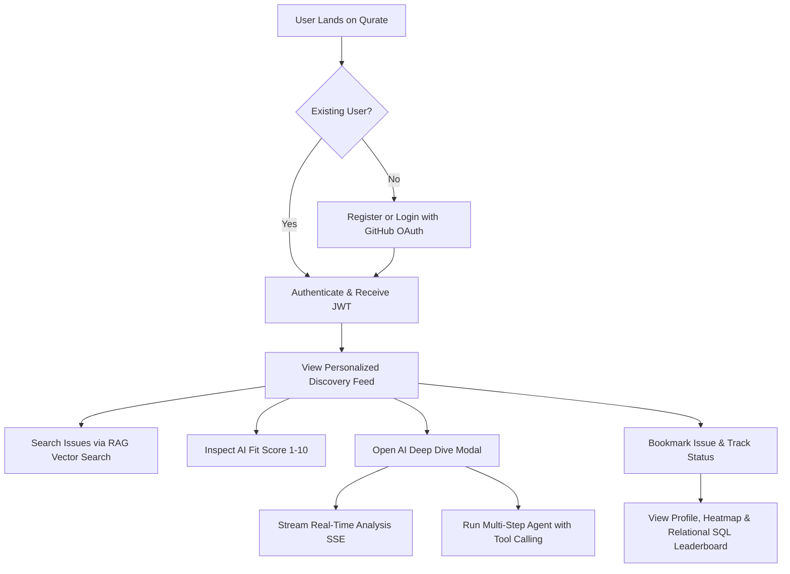

# Product Requirements Document (PRD) — Qurate

**Product Name:** Qurate — AI-Powered Open Source Discovery & Contribution Engine  
**Version:** 1.2.0  
**Status:** Active / Production-Ready  
**Target Audience:** Open-Source Contributors, Engineering Students, Software Developers, Maintainers  

---

## 1. Executive Summary & Problem Statement

### 1.1 Problem Statement
Finding meaningful open-source issues to contribute to is notoriously difficult. Developer platforms like GitHub host millions of open issues, but existing discovery mechanisms suffer from critical shortcomings:
- **Noise & Irrelevance:** Searching tags like `"good first issue"` yields tens of thousands of abandoned repositories, stale tickets, or issues in unfamiliar programming languages.
- **Skill Mismatch:** Standard issue lists do not account for a developer's declared technology stack, skill proficiency, or personal learning trajectory.
- **Onboarding Friction:** Beginners struggle to understand where to start in large codebases, what branch conventions to follow, and how to verify their contributions before opening pull requests.

### 1.2 Product Vision
**Qurate** is an intelligent open-source discovery and contribution engine that removes friction from open-source collaboration. It indexes real GitHub issues, computes AI-driven fit scores personalized to each developer's declared stack and experience level, provides real-time streaming guidance and multi-step autonomous contribution roadmaps, and tracks developer journeys from first bookmark to merged PR.

---

## 2. Target Personas

| Persona | Description | Core Goals | Pain Points |
| :--- | :--- | :--- | :--- |
| **Beginner Contributor (Alex)** | CS Student / Junior Dev looking for first open-source contributions. | Find beginner-friendly React/JavaScript issues with step-by-step guidance. | Intimidated by complex issue descriptions and unclear PR workflows. |
| **Intermediate Engineer (Sarah)** | Full-stack developer wanting to build public portfolio in Next.js & Python. | Filter high-signal issues matching specific stack with automated fit scoring. | Wasting time reading through stale or poorly triaged issues. |
| **Open-Source Mentor (Chen)** | Senior engineer / team lead evaluating candidate skills and contributions. | Track verified pull requests, contributor heatmaps, and SQL analytics. | Hard to track multi-repository contribution progress in one dashboard. |

---

## 3. Key Value Propositions & Metrics (KPIs)

- **90% Reduction in Issue Discovery Time:** Instant semantic search and personalized stack matching.
- **100% Explainable Fit Scoring:** AI assigns a score (1–10) with an actionable, plain-English reason.
- **Autonomous Step-by-Step Roadmaps:** Multi-step agent inspects repository tech stack and generates branch & PR guidelines.
- **Comprehensive Contributor Tracking:** Synchronized GitHub contribution heatmaps and SQL leaderboard analytics.

---

## 4. Detailed Functional Requirements

### 4.1 AI Discovery & Scoring Engine
- **FR-1.1 (Personalized Feed):** Display open issues filtered by developer’s preferred stack (e.g., React, Node.js, Python, TypeScript) and complexity level (`beginner`, `intermediate`, `advanced`).
- **FR-1.2 (AI Fit Scoring):** Score each issue (1–10) using Google Gemini AI with strict structured JSON output and fallback resilience.
- **FR-1.3 (RAG Semantic Vector Search):** Provide semantic vector search powered by cosine similarity matching across issue descriptions and developer skill embeddings.
- **FR-1.4 (Real-Time Streaming Analysis):** Stream chunk-by-chunk architectural breakdowns via Server-Sent Events (SSE) including potential pitfalls and implementation steps.
- **FR-1.5 (Autonomous Multi-Step Agent):** Provide an autonomous contribution planner that invokes tools (`get_repository_tech_stack`, `check_contributor_guidelines`, `calculate_pr_readiness_score`) via LLM function calling to deliver comprehensive PR guides.
- **FR-1.6 (Token & Cost Tracking):** Monitor prompt and candidate tokens for every LLM call and calculate estimated USD costs.
- **FR-1.7 (Prompt Injection Defenses):** Defend AI prompts against jailbreaks, system prompt overrides, and malicious inputs.

### 4.2 Authentication & Security
- **FR-2.1 (JWT Authentication):** Secure user registration and login with bcrypt password hashing (10 salt rounds) and 7-day token issuance.
- **FR-2.2 (OAuth 3rd-Party Login):** Support 1-click GitHub OAuth authentication and profile auto-provisioning.
- **FR-2.3 (Role-Based Access Control - RBAC):** Support user roles (`user`, `admin`) with authorization middleware guarding administrative metrics and controls.
- **FR-2.4 (Rate Limiting):** Apply endpoint-specific rate limiting across auth endpoints (20 req/15 min), AI routes (30 req/min), and general API (150 req/15 min).
- **FR-2.5 (Input Sanitization):** Automatically sanitize incoming request bodies and query parameters against XSS, null bytes, and NoSQL injection keys.

### 4.3 Contributor Journey & Tracking
- **FR-3.1 (Bookmark System):** Allow users to save issues to a persistent bookmark deck with one-click toggling.
- **FR-3.2 (Contribution Lifecycle Log):** Track issues through contribution states: `planned` ➔ `submitted` ➔ `merged`.
- **FR-3.3 (GitHub Activity Calendar & Heatmap):** Pull real-time contribution events from the GitHub GraphQL API.
- **FR-3.4 (Profile Avatar Upload):** Allow users to upload custom image avatars with file format and size validation.

### 4.4 Relational SQL Analytics & Community Leaderboard
- **FR-4.1 (Normalized Relational Schema):** Maintain a normalized relational SQL schema with Primary Keys (`PK`) and Foreign Keys (`FK`).
- **FR-4.2 (Multi-Table SQL JOINs):** Compute live contributor leaderboards and repository statistics using SQL `LEFT JOIN`, `INNER JOIN`, and aggregation queries.

---

## 5. Non-Functional Requirements (NFR)

- **Performance:** Feed response times < 200ms for cached issues; initial streaming chunk < 800ms.
- **Security:** Strict CORS whitelist, hashed passwords, parameterized SQL queries, and prompt safety guards.
- **Reliability:** 99.9% uptime with offline local fallback scoring when external AI rate limits occur.
- **Scalability:** Stateless JWT authentication and background cron synchronization every 6 hours.

---

## 6. User Journey Workflow

