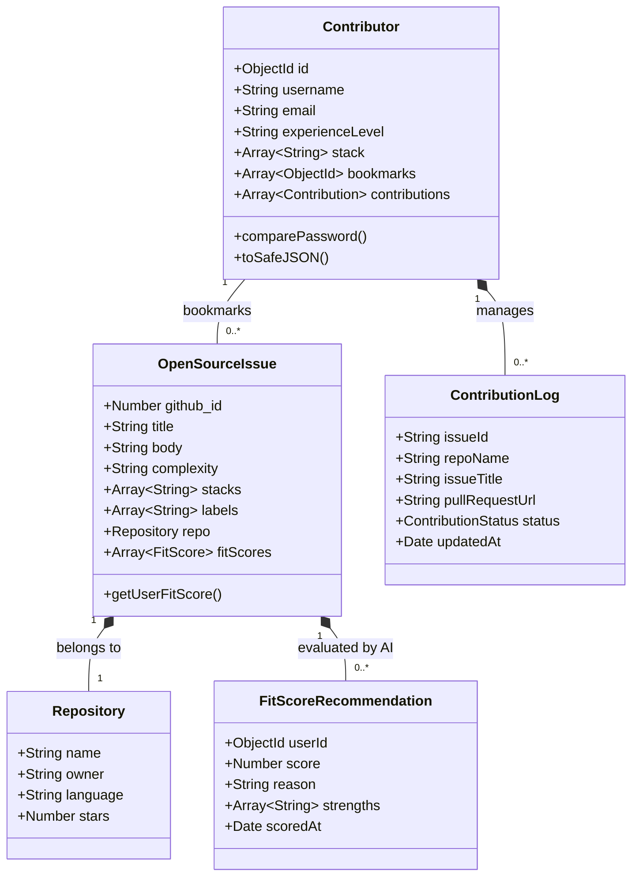
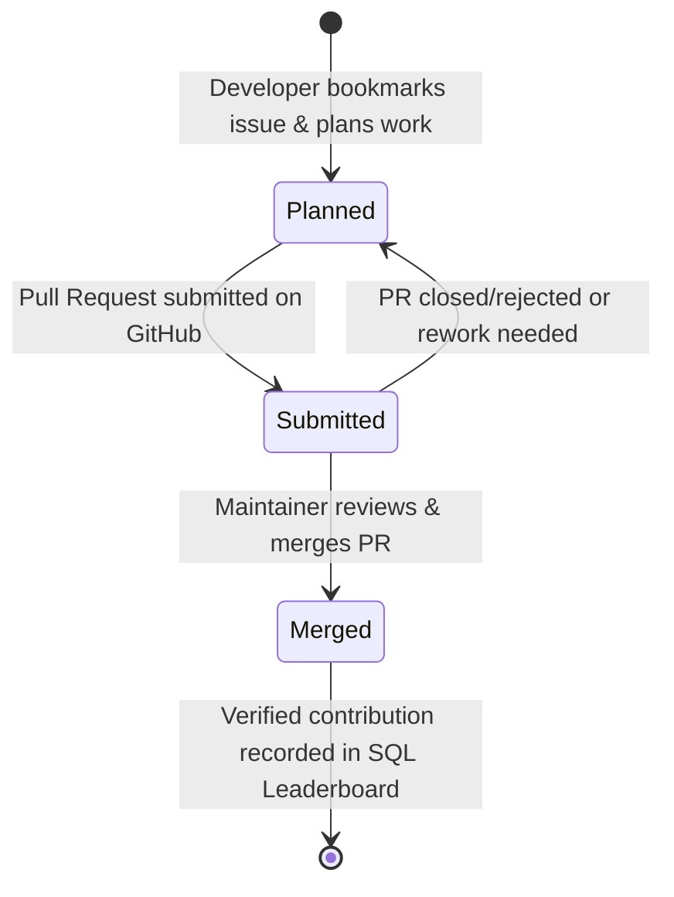

# ✦ Problem Modeling & Domain Architecture — Qurate

**Curriculum Concept:** Problem Modeling (Backend & System Design • 0.2 pts)  
**System:** Qurate — AI-Powered Open Source Discovery & Contribution Engine

---

## 1. Domain Problem Statement

### 1.1 The Discovery Gap
Open source collaboration is hindered by high noise-to-signal ratios. While GitHub hosts millions of open issues, developers face:
1. **Unstructured Skill Alignment:** Difficulty matching complex issue descriptions against declared languages and skill levels.
2. **Fragmented Workflows:** Disconnected tooling between discovering an issue, planning a contribution, opening pull requests, and showcasing verified merged PRs.
3. **Information Asymmetry:** Stale labels (e.g. `"good first issue"` on abandoned repositories) mislead beginners.

### 1.2 System Objective
Qurate models this domain by providing a unified pipeline that bridges **Contributor Capabilities** with **Repository Demands** via semantic AI matchmaking and transparent lifecycle tracking.

---

## 2. Core Domain Entities & Relationships



---

## 3. Contribution Lifecycle State Machine

The progression of an open source contribution follows a strict finite state machine:



### State Definitions:
- **`planned`**: The contributor has saved the issue to their active working list.
- **`submitted`**: The contributor has opened a pull request on the target repository.
- **`merged`**: The pull request has been merged upstream into the repository's main branch.

---

## 4. Bounded Contexts & Subsystem Architecture

Qurate separates concerns into four distinct Bounded Contexts:

| Bounded Context | Responsibility | Key Components |
|:---|:---|:---|
| **1. Discovery & Ingestion** | Fetches issues from GitHub REST API, applies language and difficulty heuristics, and caches data. | `githubServices.js`, `issueSyncScheduler.js`, `models/issue.js` |
| **2. AI Recommendation & Scoring** | Evaluates issue-user fit using Gemini LLM structured outputs and vector RAG cosine similarity. | `aiScoringService.js`, `ragService.js`, `promptDefenseService.js` |
| **3. Contributor Journey Tracking** | Manages user profiles, bookmark decks, and contribution state transitions. | `controllers/userController.js`, `models/user.js` |
| **4. Relational Analytics & Leaderboard** | Maintains normalized relational tables for cross-repository SQL queries, badges, and rankings. | `sqlAnalyticsService.js`, `config/sqlDatabase.js` |

---

## 5. Layered Architecture Pattern

```
┌────────────────────────────────────────────────────────┐
│  Presentation Layer (React 19, Client-Side Routing)     │
│  - App.jsx (Routes: /feed, /discover, /bookmarks, etc.)│
│  - Composed Compound Components (Card, Modal, Badge)   │
└──────────────────────────┬─────────────────────────────┘
                           │ HTTP / JSON
┌──────────────────────────▼─────────────────────────────┐
│  API & Controller Layer (Express.js)                   │
│  - Route Handlers & Input Sanitization Middleware      │
│  - Rate Limiting & JWT Authentication Guard            │
└──────────────────────────┬─────────────────────────────┘
                           │
┌──────────────────────────▼─────────────────────────────┐
│  Domain Service Layer (Business Logic)                 │
│  - AI Scoring & Prompt Engineering Service             │
│  - GitHub Synchronization & Scheduler Service          │
│  - Event Loop Non-blocking Batch Processors            │
└──────────────────────────┬─────────────────────────────┘
                           │
┌──────────────────────────▼─────────────────────────────┐
│  Data Persistence Layer (Hybrid Storage)               │
│  - MongoDB (Mongoose): Documents, Text Indexes, Virtuals│
│  - SQLite (sql.js): Normalized Relational Leaderboards │
└────────────────────────────────────────────────────────┘
```
